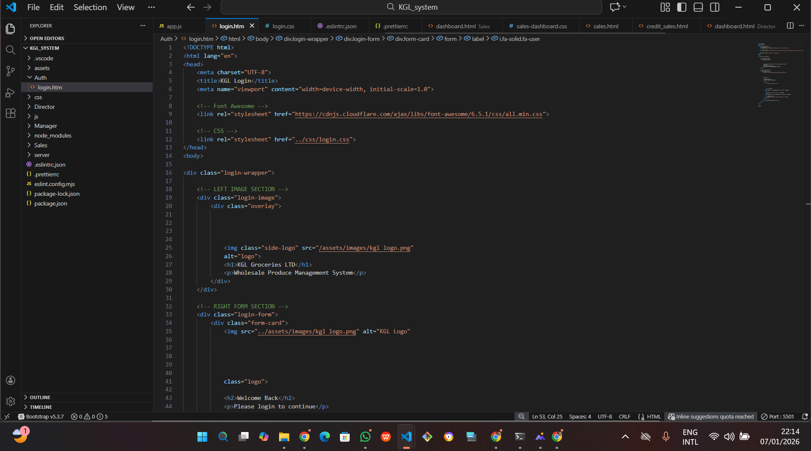
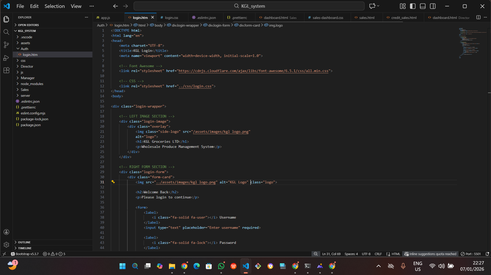

# Karibu Groceries Limited (KGL) Management System



Before using Prettier:

The code’s layout, indentation, and spacing are inconsistent.

Different lines might use different amounts of space or indentation levels.

Extra blank lines or random spaces may make it harder to read.




After using Prettier:

Prettier parses the code and rewrites it according to a set of consistent rules. It doesn’t just tweak spacing — it replaces the original layout entirely with a uniform format. 
Prettier

Unnecessary indentations, extra spaces, and inconsistent formatting are removed or standardized.

## Description
Karibu Groceries Limited (KGL) is a wholesale produce distributor dealing mainly in cereals.  
The company operates two branches located in different areas and has been recording all its business operations manually in ruled black books.

This project is a software solution developed to digitize and automate KGL’s operations.  
The system helps manage produce procurement, sales, credit sales, stock levels, and user roles, improving accuracy, efficiency, and reporting.

---

## Business Overview
KGL deals in the following produce:
- Beans
- Grain Maize
- Cow peas
- Ground nuts (G-nuts)
- Soybeans

### Sources of Produce
- Individual dealers supplying not less than 1 ton (1000kg)
- Other companies willing to sell to KGL
- KGL’s own farms located in Maganjo and Matugga

Each branch has:
- One Manager  
- Two Sales Attendants (Sales Agents)

---

## System Features

### 1. Produce Procurement (Manager Only)
The manager records all procured produce with the following details:
- Name of produce  
- Type of produce  
- Date and time of procurement  
- Tonnage in kilograms  
- Cost in Ugandan Shillings (UGX)  
- Dealer’s name  
- Intended branch  
- Dealer’s contact  
- Selling price  

---

### 2. Produce Selling (Sales Agents)
Sales agents record all sales made at their respective branches, including:
- Name of produce  
- Tonnage sold  
- Amount paid (UGX)  
- Buyer’s name  
- Sales agent’s name  
- Date and time of sale  

---

### 3. Produce Sold on Credit (Deferred Payments)
Trusted buyers may receive produce on credit. These records are stored separately and include:
- Buyer’s name  
- National Identification Number (NIN)  
- Location  
- Contact information  
- Amount due (UGX)  
- Sales agent’s name  
- Due date  
- Produce name and type  
- Tonnage  
- Date of dispatch  

---

## Business Rules
- Only produce available in stock can be sold  
- Stock is reduced automatically after every sale  
- Manager determines and sets selling prices  
- Prices are pre-populated and not set by sales agents  
- Sales agents are not allowed to record produce procurement  
- The manager is allowed to record produce procurement and sales  
- The Director can only view totals and aggregated sales from all branches  

---

## User Roles
- **Manager**: Records procurement, manages stock, and oversees branch sales  
- **Sales Agent**: Records sales and credit sales at their branch  
- **Director**: Views aggregated sales data from all branches (read-only access)  

---

## Technologies Used
- HTML  
- CSS  
- JavaScript  
- Node.js  
- MongoDB  
- ESLint (code quality and error checking)  
- Prettier (code formatting)  

---

## Code Quality and Standards
- ESLint is used to detect syntax, logic, and style errors  
- Prettier ensures consistent formatting across the project  
- Issues such as unused variables, incorrect comparisons, and formatting inconsistencies were fixed  

---

## Installation
1. Clone the repository:
   ```bash
   git clone <your-github-repository-link>
